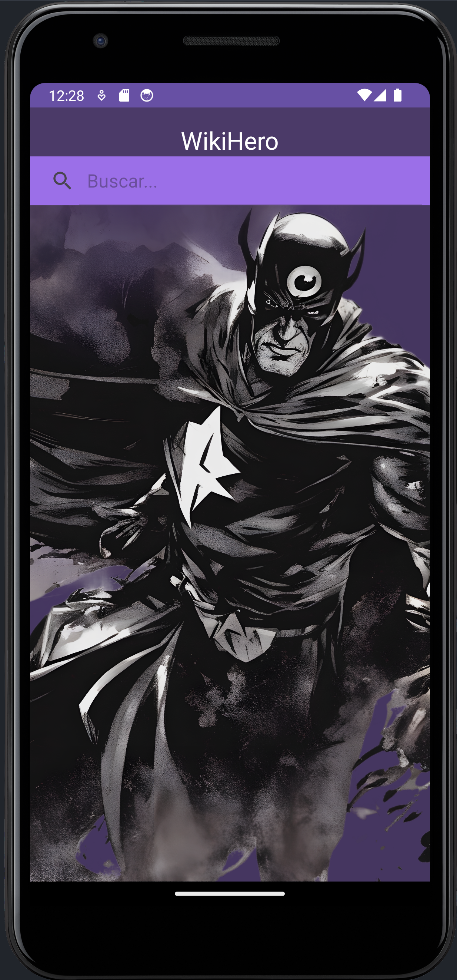
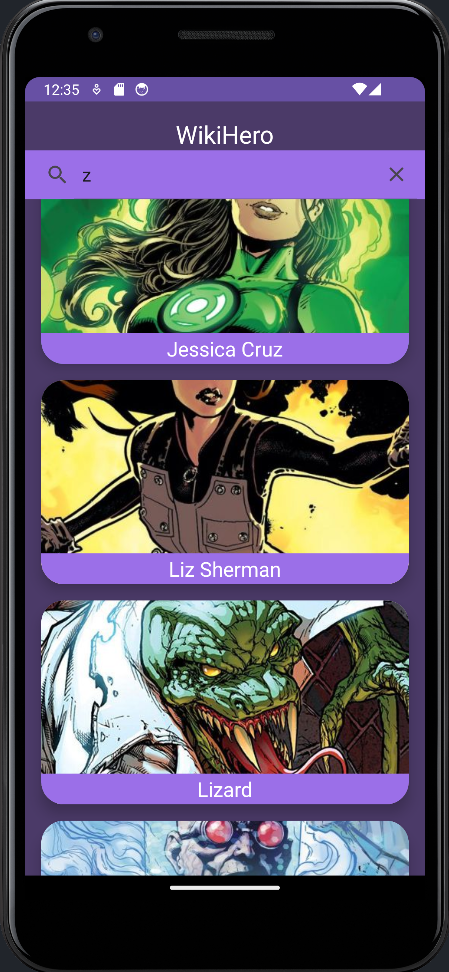
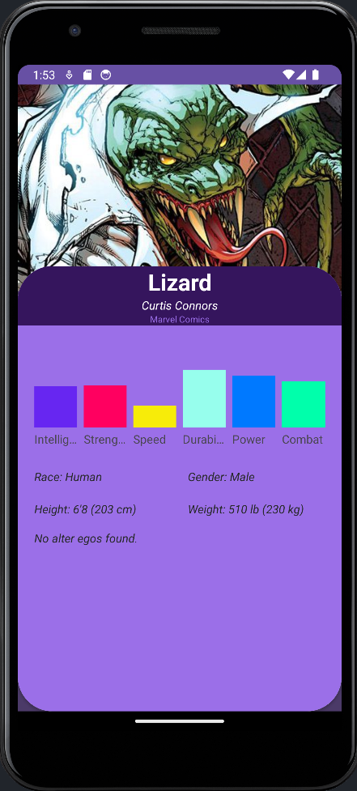
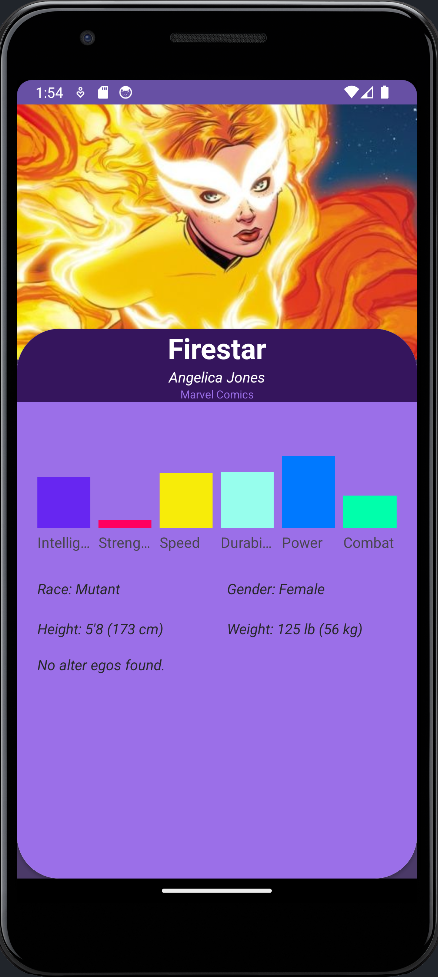

# WikiHero App

## Descripción
Esta es una aplicación Android que permite a los usuarios buscar y ver información sobre superhéroes utilizando la API de SuperheroAPI. La aplicación muestra detalles como el nombre, imagen, estadísticas de poder, nombre real, editorial, raza, género, altura, peso y alter ego de los superhéroes.

## Características
- Búsqueda de superhéroes por nombre.
- Visualización de detalles completos de un superhéroe, incluyendo estadísticas y detalles personales.
- Presentación de la información en una interfaz de usuario amigable.

## Capturas de Pantalla
 

 

## Cómo Usar
1. Abre la aplicación.
2. En la pantalla principal, utiliza la barra de búsqueda para buscar un superhéroe por nombre.
3. Haz clic en un superhéroe en la lista de resultados para ver detalles completos.
4. En la pantalla de detalles, encontrarás información detallada, incluyendo estadísticas, raza, género, altura, peso y alter ego.

## Requisitos Técnicos
- Android Studio
- Conexión a Internet

## Construcción del Proyecto
Este proyecto utiliza la librería Retrofit para realizar llamadas a la API de SuperheroAPI y la librería Picasso para la carga de imágenes. Las llamadas a la API se manejan de forma asíncrona utilizando Coroutines.
## Recuerda pedir tu api en [SuperheroAPI](https://superheroapi.com/)

